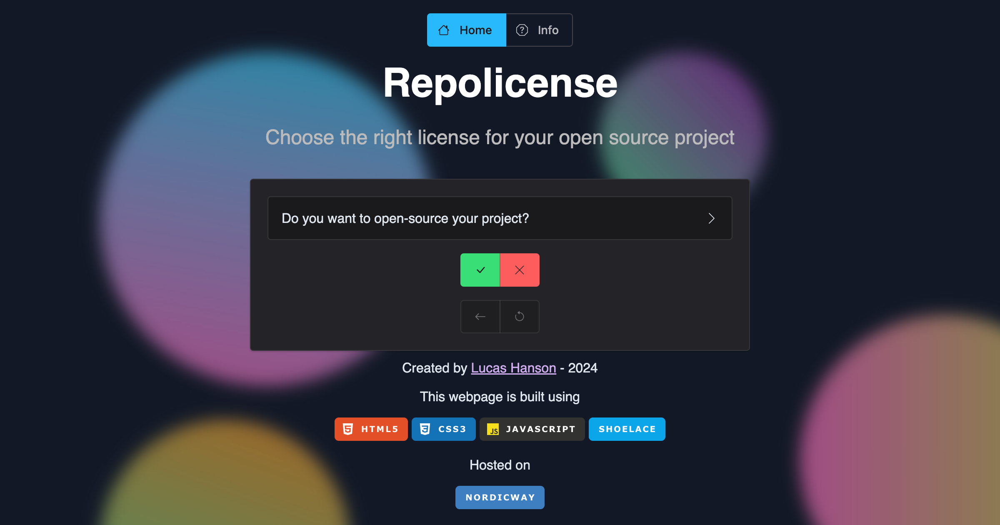

# Repolicense

Welcome to **Repolicense**! This project was created to simplify the often overwhelming task of selecting the right license for your open-source project. With so many licensing options available, it can be difficult to determine which one best fits your needs. 
Repolicense aims to solve this by providing a simple, intuitive tool that guides you through the process of choosing the appropriate license based on your project's requirements.

You can explore the tool at [repolicense.com](https://repolicense.com).

## Why Repolicense?

Choosing a license is critical in open-source development, as it dictates how others can use, modify, and distribute your work. 
Repolicense helps you navigate this process by asking straightforward questions to determine the best license for your project. 
Whether you're a seasoned developer or new to open source, Repolicense makes the decision process more accessible.

## Feedback and Contributions

I value feedback and contributions from the community! If you have ideas, or suggestions, or would like to contribute to the project, please refer to the [CONTRIBUTING.md](CONTRIBUTING.md) file. 

## License

This project is licensed under the GNU General Public License Version 3.0. 
You can read the full license text in the [LICENSE](LICENSE.md) file.

As a fun fact, the license for this project was selected using Repolicense itself — very meta.

## Getting Started

To get started with Repolicense, simply visit the website at [repolicense.com](https://repolicense.com) and answer the questions to find the best license for your open-source project.

If you'd like to contribute to the project please check out the [CONTRIBUTING.md](CONTRIBUTING.md) file for detailed instructions.

## Contact

If you have any questions or just want to share your thoughts, feel free to reach out! You can contact the project maintainer at [contact+repolicense@lucashanson.dk](mailto:contact+repolicense@lucashanson.dk).
